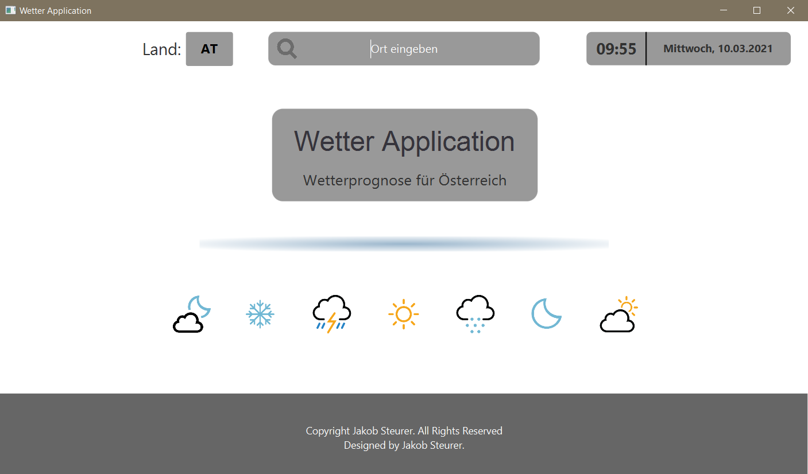
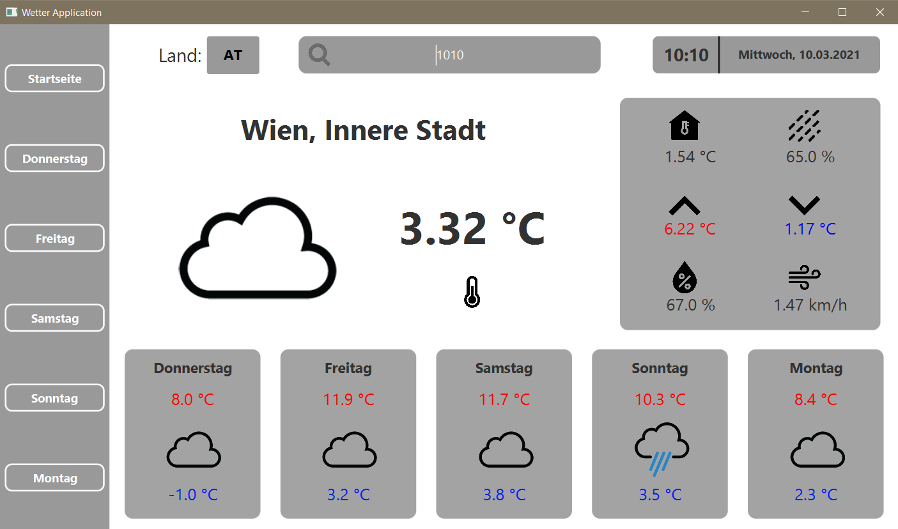
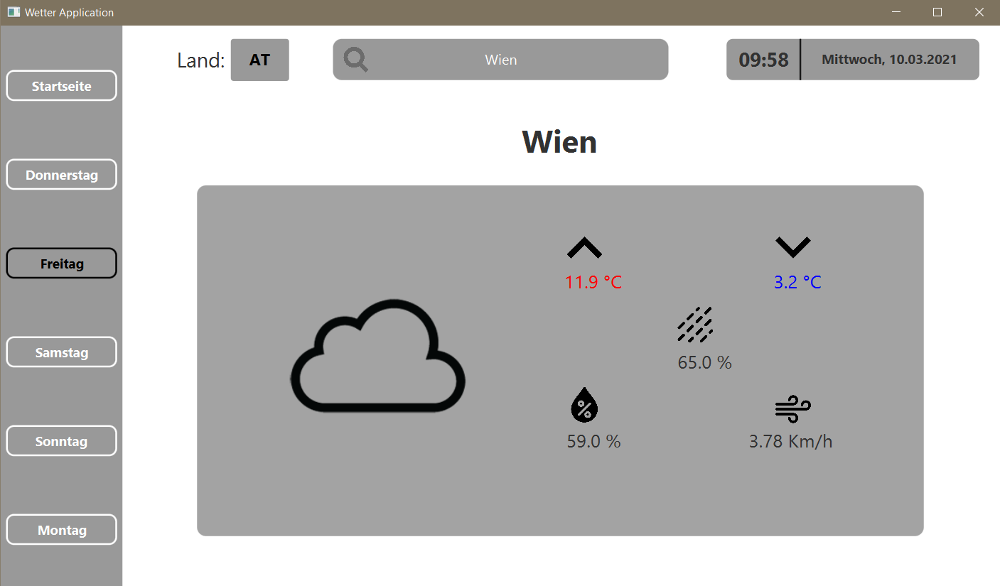
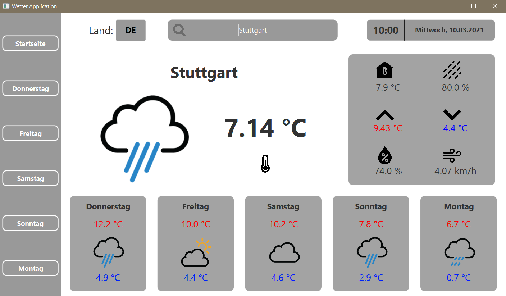
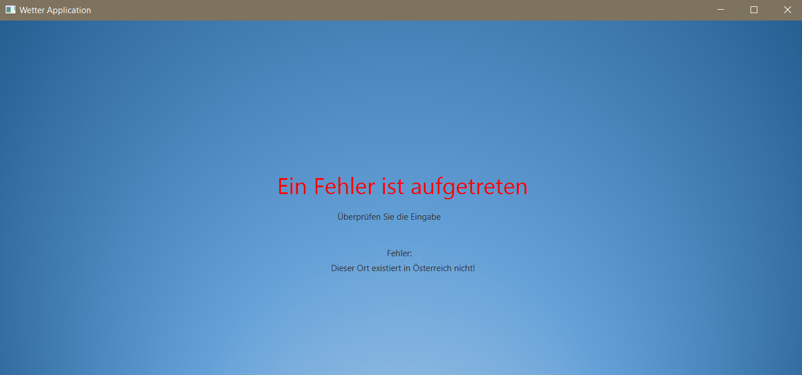

# SWP_Projekt_Wetterstation

 

  

  <h3 align="center">Wetterstation</h3>

## Über das Projekt

Dieses Projekt dient einer Wettervorhersage für den aktuelle Tag und die darauffolgenden 5 Tage.
Diese Daten werden anschließend in eine geeignete Datenbank von MySql gespeichert.
Das Projekt wurde im Rahmen meiner Schule im Programmierunterricht durchgeführt. 
Der Benutzer wird aufgefordert den gewünschten ort (in Österreich oder Deutschland) für welchen er eine Wettervorhersage bekommen möchte einzugeben.
Als Datenquelle wurden 2 APIs verwendet und das Userinterface wurde mithilfe von JavaFx erstellt. 

## Installation

- Programmiersprache Java
- Javafähige Programmierumgebung (z.B. Eclipse, IntelliJ, ...)
- JavaFx (e(fx)clipse)
- MySql Datenbank
- 1 API: <a href="https://Openweathermap.com">Openweathermap.com</a>
- 2 API: <a href="https://Weatherbit.io">Weatherbit.io</a> 
- JavaFx Scene Builder

## Vorschau
Die Applikation erschließt sich aus vier Fenstern.
- Das erste Fenster dient zur Eingabe des gewünschten Ortes (Deutschland/Österreich): 
 
- Das zweite Fenster veranschaulicht die Wetterdaten mit passenden Bildern. Man sieht hier, dass die Eingabe über die Postleitzahl ebenfalls möglich ist 
 
- Das dritte Fenster zeigt mehr Daten für die Prognose mit passenden Bildern 
 
- Das gleiche hier für Deutschland 
 
- Das vierte Fenster erscheint wenn ein ungültiger Ort eingegeben wurde oder dieser sich nicht in Östtereich bzw. Deutschland befindet. 

## Kontakt

If you have any questions about this project, please feel free to contact me.

Student name 1 here - jaksteurer@tsn.at 
HTL Anichstraße - htlinn@tsn.at

