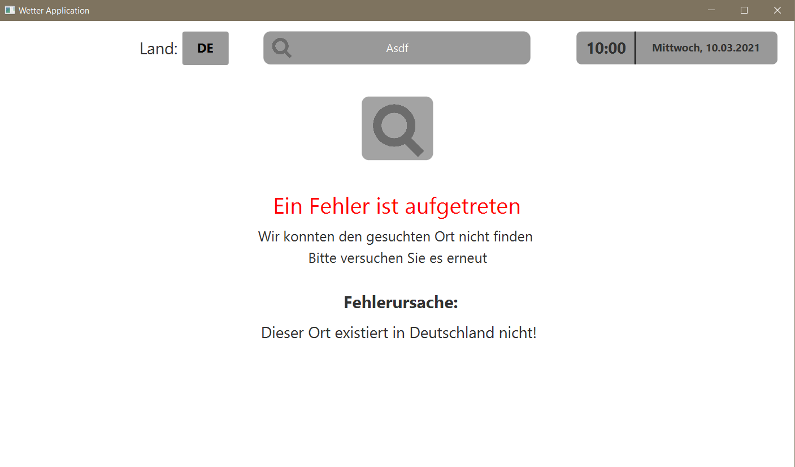

# SWP_Projekt_Wetterstation

<br/>
<p align="center">
  <a href="https://htl-anichstrasse.tirol">
    
  </a>

  <h3 align="center">Wetterstation</h3>

  <p align="center">
    Enter a short description for the project here
    <br/>
    <a href="https://github.com/htl-anichstrasse/template/releases">Releases</a>
    ·
    <a href="https://github.com/htl-anichstrasse/template/issues">Report Bug</a>
    ·
    <a href="https://github.com/htl-anichstrasse/template/issues">Request Feature</a>
  </p>
</p>

## Über das Projekt

Dieses Projekt dient einer Wettervorhersage für den aktuelle Tag und die darauffolgenden 5 Tage.
Diese Daten werden anschließend in eine geeignete Datenbank von MySql gespeichert.
Das Projekt wurde im Rahmen meiner Schule im Programmierunterricht durchgeführt. 
Der Benutzer wird aufgefordert den gewünschten ort (in Österreich!) für welchen er eine Wettervorhersage bekommen möchte einzugeben.
Als Datenquelle wurden 2 APIs verwendet und das Userinterface wurde mithilfe von JavaFx erstellt. 

## Installation

- Programmiersprache Java
- Javafähige Programmierumgebung (z.B. Eclipse, IntelliJ, ...)
- JavaFx
- MySql Datenbank
- 1 API: <a href="https://Openweathermap.com">Openweathermap.com</a>
- 2 API: <a href="https://Weatherbit.io">Weatherbit.io</a> 
- JavaFx Scene Builder

Clone the repository.
```
git clone https://github.com/jaksteurer/SWP_Projekt_Wetterstation
```
## Vorschau
Die Applikation erschließt sich aus drei Fenstern (JavaFx: Panes).
- Das erste Fenster dient zur Eingabe des gewünschten Ortes:<br>
<a target="_blank"></a><br>
- Das zweite Fenster veranschaulicht die Wetterdaten mit passenden Bildern<br>
<a target="_blank"></a><br>
- Das dritte Fenster erscheint wenn ein ungültiger Ort eingegeben wurde oder dieser sich nicht in Östtereich befindet.<br>
<a target="_blank"></a>


## Kontakt

If you have any questions about this project, please feel free to contact me.

Student name 1 here - jaksteurer@tsn.at<br>
HTL Anichstraße - htlinn@tsn.at

<a href="https://htl-anichstrasse.tirol" target="_blank"></a>
